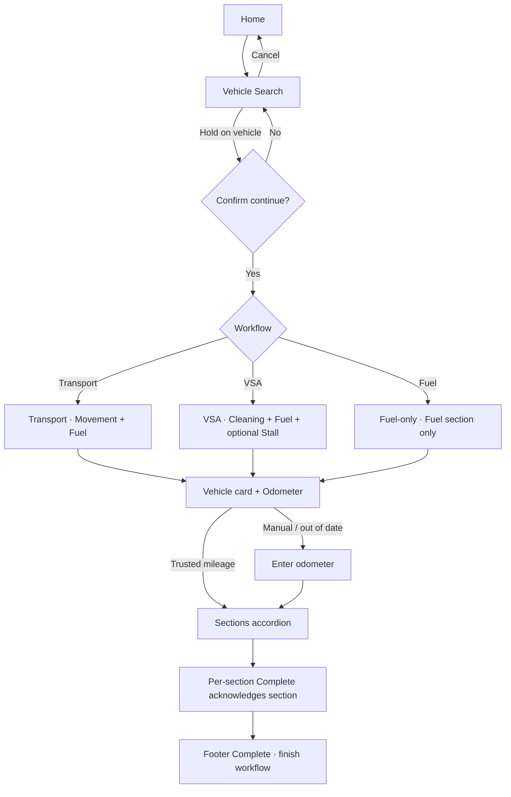
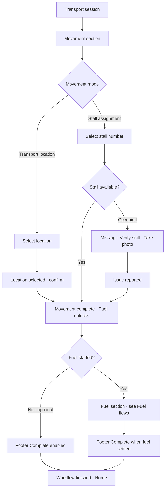
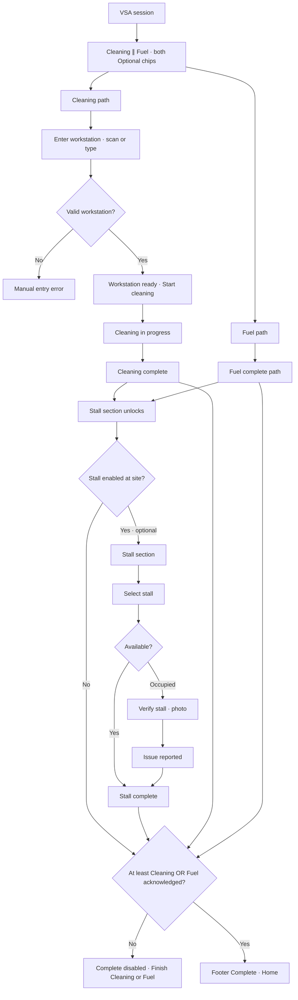
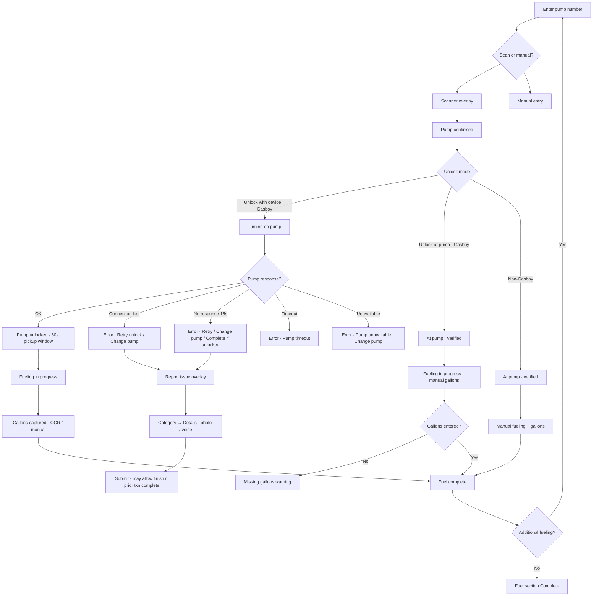
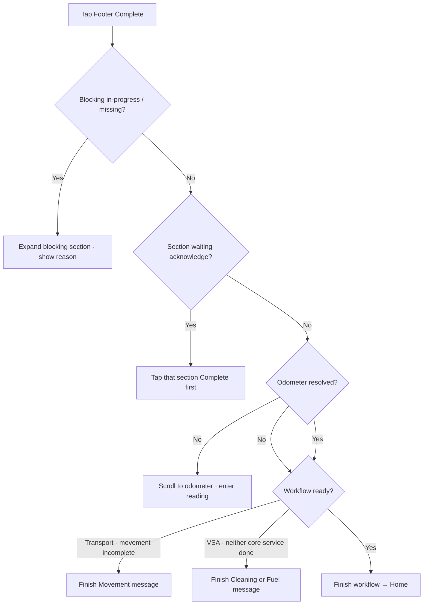

# Daytona — Stakeholder workflow flow diagrams

Source of truth: `workflowProgress.ts`, `flowNavigation.ts`, `progress.ts`, `TransportScreen`, `VsaScreen`.

**How to use in Miro:** Board [uXjVHAsM1OU](https://miro.com/app/board/uXjVHAsM1OU=/) → Insert → Diagram / paste Mermaid blocks below into frames.

---

## 1. Entry (all workflows)

---

## 2. Transport — scenario matrix

**Sections:** Movement (required) · Fuel (optional until started)

| Scenario | Movement mode | Fuel | Finish rule |
|----------|---------------|------|-------------|
| Move only | Transport location | Skip (not started) | Movement acknowledged |
| Move + fuel | Transport location | Full fuel path | Movement + fuel settled |
| Stall only | Stall assignment | Skip | Movement acknowledged |
| Stall + fuel | Stall assignment | Full fuel path | Movement + fuel settled |

**Transport Complete — blocked when:**
- Movement not complete
- Fuel in progress or missing info (once fuel started, cannot skip)
- Odometer unresolved
- Another section still in progress
- Section complete but not yet acknowledged (tap section Complete first)

---

## 3. VSA — scenario matrix

**Sections:** Cleaning + Fuel (parallel, at least one required) · Stall (optional, site toggle)

| Scenario | Cleaning | Fuel | Stall | Finish rule |
|----------|----------|------|-------|-------------|
| Clean only | Complete + ack | Skip | Skip | Cleaning ack |
| Fuel only | Skip | Complete + ack | Skip | Fuel ack |
| Clean + fuel | Both complete + ack | Both | Skip | Both ack if done |
| Clean + stall | Complete + ack | Skip | Complete + ack | Cleaning + stall if used |
| Fuel + stall | Skip | Complete + ack | Complete + ack | Fuel + stall if used |
| Clean + fuel + stall | All used | All | All | All completed sections ack |

**Stall lock:** Stall accordion disabled until Cleaning **or** Fuel is complete — not while either is in progress.

**VSA parallel rule:** Completing/acknowledging Cleaning does **not** require Fuel to be idle (and vice versa).

---

## 4. Fuel — shared flow (Transport · VSA · Fuel-only)

Three unlock modes (site/pump):

**Transport fuel optional:** If operator never opens Fuel, footer Complete after Movement only.

**Transport fuel started:** Footer Complete blocked until fuel completes, errors resolve, or issue-report completion path applies.

---

## 5. Error & recovery summary

| Area | State | Operator action | Complete impact |
|------|-------|-----------------|-----------------|
| Odometer | Trusted | Auto-filled | — |
| Odometer | Manual required | Enter reading | Blocked until valid |
| Odometer | Below floor | Validation error | Blocked |
| Movement stall | Occupied | Photo → issue reported | Movement can complete |
| VSA stall | Occupied | Photo → issue reported | Stall can complete |
| Fuel remote | Connection lost | Retry / change pump | Blocked while unlocking |
| Fuel remote | No response | Retry / change / complete if unlocked | Uncertain unlock path |
| Fuel remote | Timeout | Change pump | Blocked |
| Fuel remote | Unavailable | Change pump | Blocked |
| Fuel on-site | Missing gallons | Enter gallons | Blocked until filled |
| Cleaning | Invalid workstation | Re-enter | Blocked at verify |
| Issue | Any workflow | Header or section report | Overlay; fuel issue may allow finish |
| Hold | Vehicle search | Confirm dialog | — |

---

## 6. Footer Complete decision tree

---

## 7. Tutorial mode (does not affect production flow)

Guided tour only: UI locked, no workflow persistence, no click tracking, state restored on skip/finish.
